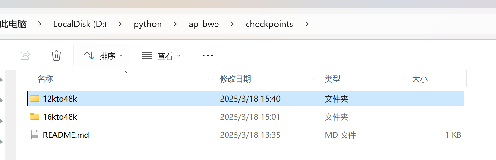
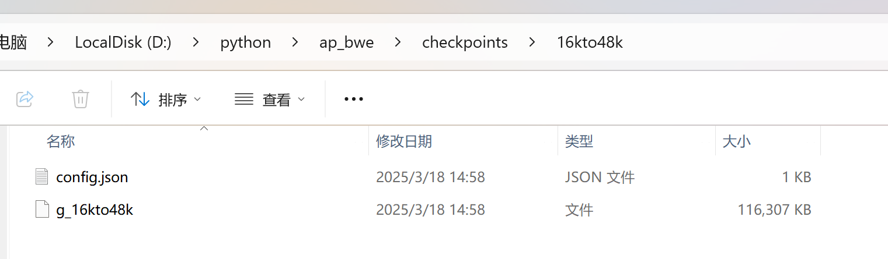

# Spark_TTS with AP_BWE
（引入[AP_BWE](https://github.com/xinan-chen/AP_BWE)项目）
你可以将长文本通过本脚本丢给[spart_tts](https://github.com/SparkAudio/Spark-TTS)启动的网页前端，有效解决了水音的问题，音频更清楚了。
<br>将webui.py进行了魔改，支持长文本分割后再拼接、语音优化。
# 推荐方法
 - 你需要配置ap_bwe的checkpoint文件。访问来自ap_bwe提供的谷歌云盘：https://drive.google.com/drive/folders/1IIYTf2zbJWzelu4IftKD6ooHloJ8mnZF
 - 下载之后放入/AP_BWE/checkpoint文件夹，如图所示。



- 然后将 plugin/webui.py 和 整个AP_BWE文件夹 都需要放入到 Spark-TTS 的根目录下方。
<br>
- 再次运行 一键启动.bat


# 代码方法
克隆下来后执行：
```cmd
pip install gradio_client tqdm
```
<br>你需要配置ap_bwe的checkpoint文件。访问来自ap_bwe提供的谷歌云盘：https://drive.google.com/drive/folders/1IIYTf2zbJWzelu4IftKD6ooHloJ8mnZF
<br>下载之后放入/AP_BWE/checkpoint文件夹，如图所示。


<br>然后修改config.py的内容。<br>
在最后执行前请保证你的spart_tts后端已经启动。<br>
最后执行
```commandline
python main.py
```

# 代码
- 本项目的plugin/webui.py仅被设计为供单人单线程使用。

# ⚠️ 使用免责声明

本项目提供了一个简易代码，旨在用于学术研究、教育目的以及合法应用，例如个性化语音合成、辅助技术和有声读物的个性化生成。

请注意：

- 请勿将此模型用于未经授权的语音克隆、模仿、欺诈、诈骗、深度伪造或任何非法活动。

- 在使用此模型时，请确保遵守当地法律法规，并秉持道德标准。

- 对于此模型的任何不当使用，开发者不承担任何责任。

我们倡导负责任地开发和使用人工智能，并鼓励社区维护安全和道德规范。 
